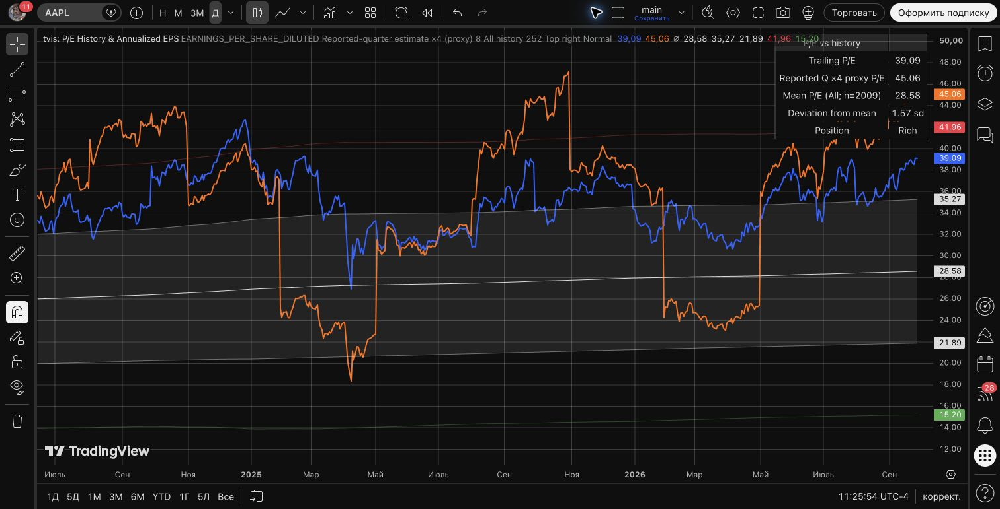

# Publication draft

**Status:** prepared, not published. Final-source live ticks and
closed-bar reload passed in both window modes on 2026-09-28; see the validation
record for exact contexts and limits. No TradingView Publish action was performed.

**ASCII title:** `tvis: P/E History & Annualized EPS`  
**Author:** `golyshevskii`  
**Source:** [`../indicators/pe.pine`](../indicators/pe.pine)  
**SHA-256:** `9230628c0e8e2690b94e6530c4e0dd9a8e36dfe2f9166417f657c30ca42120d4`
**License:** MPL-2.0, with the source notice and author attribution retained.

## English description

Compare a stock's trailing price-to-earnings ratio with its own loaded chart
history. Choose diluted or basic trailing-twelve-month EPS. The indicator
shows trailing P/E, its arithmetic mean, population standard-deviation bands,
and **Deviation from mean** with a descriptive historical position.
Position text is green for Cheap, brighter green for Very cheap, red for Rich
and brighter red for Very rich; Normal retains the theme foreground color.
The compact five-row table has no heading.

Deviation from mean is the z-score: `(current P/E - mean) / sigma`. Its unit,
`sd`, means standard deviations. Positive values are above the historical mean,
negative values below it; `1.5 sd` means 1.5 standard deviations above the mean.
This describes relative historical position, not a probability or trade signal.

An optional second ratio offers two distinct methods:

- **Reported-quarter estimate x4 (proxy):** current price divided by four
  times the latest estimate attached to an already reported earnings event.
  This extrapolates one quarter; it is not the upcoming-quarter estimate or
  next-twelve-month consensus.
- **Growth assumption:** current price divided by TTM EPS multiplied by
  one plus your assumed annual growth rate. This is a scenario, not analyst data.

**All history** includes valid P/E values from the bars TradingView loaded.
**Rolling lookback** uses the last N consecutive chart bars, including the
current bar. Missing P/E consumes a window slot but does not enter the
arithmetic. Warm-up uses the available prefix. The default 252 means chart
bars, so its calendar length changes with the timeframe.

Missing or nonpositive EPS/price produces an unavailable ratio. Unsupported
fundamentals return n/a without stopping the script. The reported-quarter
proxy can remain available when trailing EPS is negative, since it uses its
own denominator. Hidden outputs do not change the trailing statistics.

The mean weights every valid chart bar equally. It is sensitive to very small
positive EPS and extreme P/E observations; values are not capped or trimmed.
For example, NOW's monthly June-August 2019 EPS was 0.0025 in the observed
provider dataset, producing P/E above 20,000. Including those observations
explains an All-history mean above 1,000 in September 2026. Changing the
window changes which observations are included; it does not correct the data.

Use standard candles, regular sessions, native quote currency and dividend
adjustment off. Synthetic charts are unsupported and are not blocked by the
script: their synthetic close changes the ratios. Minor-unit quotes, chart
currency overrides and extended sessions have not been validated. Corporate
action and ADR adjustments come from the provider; the indicator does not
apply an additional split or ADR multiplier.

The bands are descriptive mean +/- one and two population standard deviations,
not guaranteed 68%/95% coverage, a price target or a trading signal. With fewer
than two valid observations, sigma and z are unavailable. With zero sigma,
z is unavailable. Verdicts use unrounded z: above 2 is Very rich, above 1
Rich, below -2 Very cheap, below -1 Cheap, otherwise Normal.

Open bars can change. Provider revisions and historical financial mapping can
change previous values, including values dated before the corresponding
release. This is not a point-in-time fundamental backtest or a promise of
unchanging history. Neither proxy nor growth scenario predicts returns.

## Substantive changes and supporting evidence

- Explicit quote-currency EPS and safe unsupported-symbol requests, positive
  denominator guards, and separate proxy/scenario labels: financial-data and
  final-matrix sections of [validation](validation.md).
- A fixed chart-bar rolling window with prefix warm-up and stable population
  statistics: history-statistics tests and the final independent numerical
  comparisons in [validation](validation.md).
- Gaps for missing current P/E, theme-aware table text, meaningful unavailable
  statuses, and independent output controls: presentation tests and the final
  output checks in [validation](validation.md).
- All history skips the unused rolling queue. The 30-run
  [Profiler experiment](performance.md) measured lower All-history medians
  with overlapping ranges; no universal speedup percentage is claimed.

The final [validation record](validation.md) states exactly which source,
contexts, dates and inputs were checked, including both final-source realtime
window modes and closed-bar reload comparisons.

## Chart image

Captured 2026-09-28 at 11:25:54 UTC-4 on BATS:AAPL 1D, native USD, regular
session, dividend adjustment off; diluted EPS, All history, reported-quarter
proxy, default growth 8%/lookback 252, bands/table on, Top right/Normal.
The exact final production pane is enlarged; the underlying chart uses standard
candles. The current daily bar is open: trailing P/E 39.09, proxy 45.06,
mean 28.58, n=2009, Deviation from mean 1.57 sd, Position Rich. This image
illustrates the interface; the separate validation record documents live ticks
and comparisons of identical closed one-minute bars.

The image records source `325a2ca…` before Position coloring and removal of the
table heading. It illustrates the same calculations; the current presentation
change is recorded separately in [validation](validation.md#position-styling--2026-09-28).
